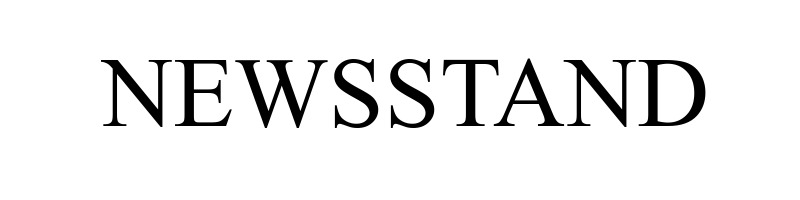

[![Contributors][contributors-shield]][contributors-url]
[![Issues][issues-shield]][issues-url]
[![MIT License][license-shield]][license-url]
[![LinkedIn][linkedin-shield]][linkedin-url]

<!-- TABLE OF CONTENTS -->

  
Table of Contents

  <ol>
    <li>
      <a href="#overview">Overview</a>
      <ul>
        <li><a href="#about-the-project">About the project</a></li>
        <li><a href="#built-with">Built With</a></li>
        <li><a href="#screenshots">Screenshots</a></li>
      </ul>
    </li>
    <li><a href="#contributing">Contributing</a></li>
    <li><a href="#license">License</a></li>
    <li><a href="#contact">Contact</a></li>
    <li><a href="#acknowledgements">Acknowledgements</a></li>
  </ol>

<!-- ABOUT THE PROJECT -->

## Overview

### About the project

The client-oriented E-Commerce project. Domain knowledge - periodical publications. The system has a list of
publications that grouped by topic.

A reader can subscribe to one or more publications. An User registers in the system and has a personal account, which
displays information about publications to which he is subscribed. An unregistered user cannot subscribe. The reader has
a personal account that he can replenish. Money are withdrawn from the account under time to subscribe to the
publication.

For a list of publications there are the possibilities:

- sorting publications by title, price, publication date;
- samples of publications on a particular genre or publisher;
- search for a publication by title.

Each of the publication has its own page with detailed information about it and rates to subscribe as well.

The system administrator has the rights to: adding, deleting and editing publications; blocking, unlocking the user. In
additional users with administrator rights can add new periods for subscriptions if no one from existed meets the
requirements.

### Built With

* [Spring Framework](https://spring.io/)
* [ORM Hibernate](https://hibernate.org/)
* [Apache Tomcat ®](http://tomcat.apache.org/)
* [Apache Maven](https://maven.apache.org/)
* [Thymeleaf](https://www.thymeleaf.org/)
* [Bootstrap](https://getbootstrap.com)
* [JQuery](https://jquery.com)

### Screenshots

<!-- ROADMAP -->

## Roadmap

See the [open issues](https://github.com/Swoq/newsstand-reborn/issues) for a list of proposed features (and known
issues).

<!-- CONTRIBUTING -->

## Contributing

Contributions are what make the open source community such an amazing place to be learn, inspire, and create. Any
contributions you make are **greatly appreciated**.

1. Fork the Project
2. Create your Feature Branch (`git checkout -b feature/AmazingFeature`)
3. Commit your Changes (`git commit -m 'Add some AmazingFeature'`)
4. Push to the Branch (`git push origin feature/AmazingFeature`)
5. Open a Pull Request

<!-- LICENSE -->

## License

Distributed under the MIT License. See `LICENSE` for more information.

<!-- CONTACT -->

## Contact

Your Name - [Mykhailo Kratiuk](https://linkedin.com/in/othneildrew) - misha.kratyuk@gmail.com

Project Link: [https://github.com/Swoq/newsstand-reborn](https://github.com/Swoq/newsstand-reborn)

<!-- ACKNOWLEDGEMENTS -->

## Acknowledgements

* [Best Practises by John Thompson](https://www.udemy.com/user/john-thompson-2/)
* [JDL Studio](https://start.jhipster.tech/jdl-studio/)
* [Spring initializr](https://start.spring.io/)

<!-- MARKDOWN LINKS & IMAGES -->
<!-- https://www.markdownguide.org/basic-syntax/#reference-style-links -->

[contributors-shield]: https://img.shields.io/github/contributors/othneildrew/Best-README-Template.svg?style=for-the-badge

[contributors-url]: https://github.com/Swoq/newsstand-reborn/graphs/contributors

[issues-shield]: https://img.shields.io/github/issues/othneildrew/Best-README-Template.svg?style=for-the-badge

[issues-url]: https://github.com/Swoq/newsstand-reborn/issues

[license-shield]: https://img.shields.io/github/license/othneildrew/Best-README-Template.svg?style=for-the-badge

[license-url]: https://github.com/othneildrew/Best-README-Template/blob/master/LICENSE.txt

[linkedin-shield]: https://img.shields.io/badge/-LinkedIn-black.svg?style=for-the-badge&logo=linkedin&colorB=555

[linkedin-url]: https://www.linkedin.com/in/mykhaylo-kratyuk-9864211a7/

[product-screenshot]: images/screenshot.png
